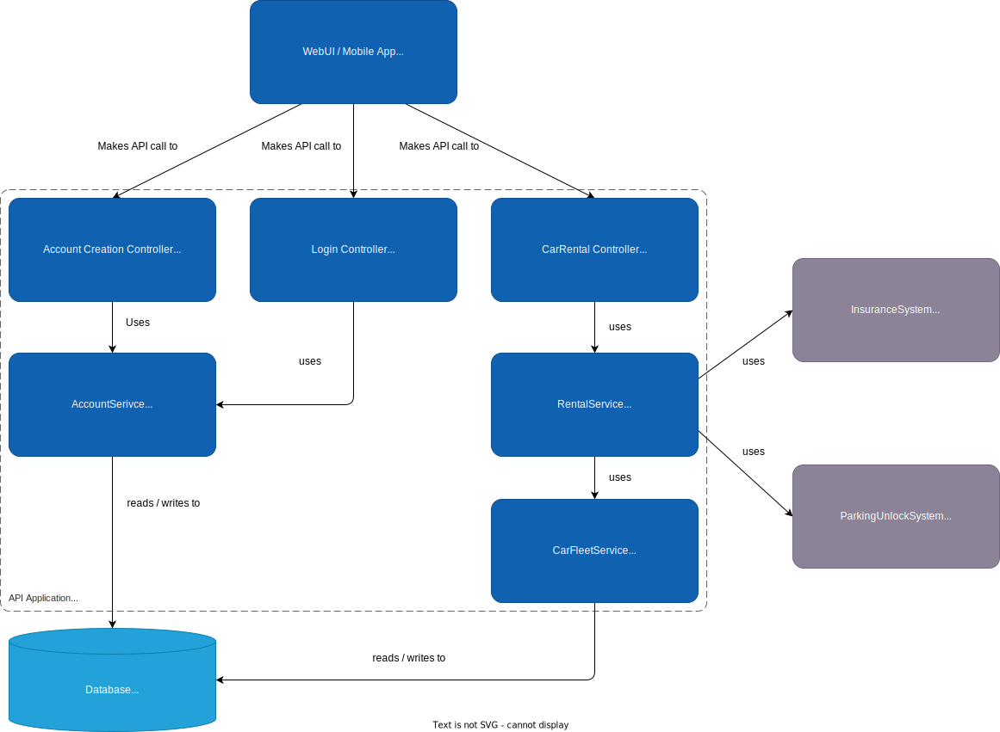

# Vision - CarRent24

!!! note 
    work in progress

```cs
public class Program{
    public static void Main(string[] args){
        Console.WriteLine("hi");
    }
}
```

## Autovermietungssystem

Das Autovermietungssystem ermöglicht es Nutzern, Fahrzeuge unterschiedlicher Klassen zu reservieren. Nutzer registrieren sich mit einer E-Mail-Adresse, Vorname, Nachname und Adresse, um Zugang zum System zu erhalten. Nach der Registrierung erhalten sie eine eindeutige Kundennummer zur Identifikation.

## Funktionalitäten

- **Registrierung und Login:** Nutzer können sich registrieren und ein Benutzerkonto erstellen, um auf das System zuzugreifen.
  
- **Fahrzeugreservierung:** Nutzer können Fahrzeuge aus verschiedenen Klassen reservieren und die gewünschte Mietdauer angeben. Die Kosten werden automatisch berechnet und eine Reservierungsnummer zugewiesen.

- **Fahrzeugabholung und Rückgabe:** Bei der Abholung wird die Reservierung in einen Mietvertrag umgewandelt. Während der Rückgabe wird ein Rückgabeprotokoll erstellt und eventuelle Schäden am Fahrzeug werden abgerechnet.

## C4-Diagramme

### System Context


### Container Diagramm


### Component Diagramm
